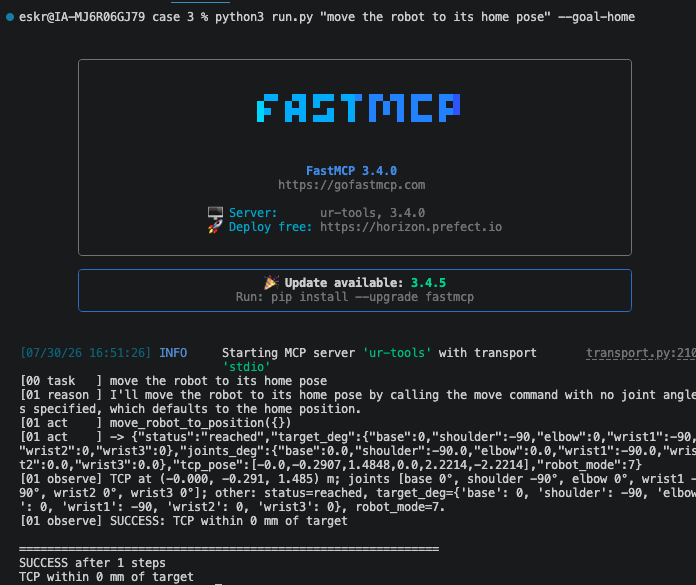

# Case 3: Autonomous Agent

Build an LLM agent that programs a UR10 for you. You give it a goal in plain
language; it runs a loop, reason, act, observe, calling robot tools until the
goal is met or it gives up.

## The task

Build the agent around a robot MCP server. The robot interface is **not** your
job here: the agent consumes an MCP server as a black box (the Case 1 server, or
the pre-built one UR provides). Your work is everything around that server, the
loop, the prompt, the state serializer, and the evaluator that decides success.

The loop:

```
task ─▶ REASON (LLM picks the next step)
          │
          ▼
        ACT (call one MCP tool ─▶ robot moves)
          │
          ▼
        OBSERVE (read state ─▶ serialize ─▶ evaluate)
          │
          └────── repeat until success or step budget ──────┘
```

## What's provided vs what you build

| Component | File | Provided? |
|-----------|------|-----------|
| Task interface / system prompt | `prompts.py` | working baseline, tweak it |
| Orchestrator loop | `agent.py` | working, read it closely |
| State serializer (robot state → words) | `serializer.py` | working baseline, improve it |
| Evaluator (did it work? + why) | `evaluator.py` | one worked example + a stub |

Supporting, provided: `llm.py` (OpenAI-compatible chat + tool calling),
`mcp_client.py` (launch + call the MCP server over stdio), `run.py` (entry point).

## Make it your own

This case is **explorative**, and what ships in the repo is only **guiding**: a
deliberately simple baseline so you can see every seam. It is a starting point,
not a spec. Read the four components, then change anything that makes the agent
better, the prompt, the loop, the serializer, the evaluator, and try different
patterns (structured output, a planner / executor split, richer state, retries,
memory, a different orchestration shape). The tiers below are the goal; how you
get there is open. As you work through them, make any change you like as long as
it improves performance, and be ready to present something of value at the end,
what you built and why your choices helped.

## Setup

1. **The PSX simulator is running and the robot is powered on.** Bring it up from
   `../simulation environment`, then open http://localhost and power the robot on
   (green / RUNNING):
   ```bash
   cd "../simulation environment" && docker compose up -d
   ```
2. **Python deps installed** in this folder:
   ```bash
   pip install -r requirements.txt
   ```
3. **An LLM endpoint.** Bring your own model (any OpenAI-compatible endpoint). No
   endpoint? Set one up for free with [`../llm-client`](../llm-client): self-hosted
   (local, Bionic) or cloud-hosted (NVIDIA NIM `z-ai/glm-5.2`, Z.AI, Modal). Any of
   them gives you three values:
   ```bash
   export AGENT_BASE_URL=https://your-endpoint/v1
   export AGENT_API_KEY=your-key
   export AGENT_MODEL=your-model-name
   ```
   Examples:
   - **Self-hosted (Bionic local):** `AGENT_BASE_URL=http://localhost:1234/v1`,
     `AGENT_API_KEY=local` (any non-empty string), `AGENT_MODEL=<loaded model id>`.
   - **Cloud-hosted (NVIDIA NIM):** `AGENT_BASE_URL=https://integrate.api.nvidia.com/v1`,
     `AGENT_API_KEY=nvapi-...`, `AGENT_MODEL=z-ai/glm-5.2`.

You do **not** start the MCP server yourself, the agent launches it as a
subprocess (see `mcp_client.py`). By default that is the Case 1 server next door;
point `--server` at UR's pre-built server or your own to use a different one. The
agent must not depend on one model's tool-use behaviour, so keep the prompt and
parsing model-agnostic.

## Run

```bash
# Bronze: run the provided agent on a simple goal, read the full loop log.
python run.py "move the robot to its home pose" --goal-home

# Point at a different server (it is launched for you):
python run.py "trace a 10 cm square" --server "python /path/to/server.py"
```

Every turn prints as `[NN phase] ...` so you can watch it reason, act, and
observe. A successful `--goal-home` run looks like this (cloud endpoint,
`z-ai/glm-5.2`): the model calls the move tool, the robot reaches home, and the
evaluator reports TCP within tolerance.



**First reply can take 30-60 s** on a free cloud endpoint (the model reasons over
the tool schema before answering). It is not frozen. Each loop step is one such
call, so a run is slower than a plain chat. A local model (self-hosted) can be
slower still. If it truly never returns, check the three `AGENT_*` values and
that a plain `curl` to the endpoint answers.

## Example tasks and world-model inputs

Concrete definitions you can hand the agent. Each task is a plain-language goal
plus how success is judged (the evaluator that goes in `evaluator.py`).

| Task | Goal string | Success check |
|------|-------------|---------------|
| Home (Bronze) | `"move the robot to its home pose"` | TCP within tolerance of the home XYZ (`ReachedPose`, wired by `--goal-home`) |
| Trace a square (Silver) | `"trace a 10 cm square in the XY plane at z = 0.30 m"` | TCP passes within tolerance through all four corners, in order (`PathTraced`) |
| Trace a triangle (Silver) | `"trace a 15 cm triangle at z = 0.30 m"` | same idea, three waypoints |
| Pick and place (Diamond) | `"pick up block_A and drop it in the bin"` | block_A ends at the bin, gripper released |

Example waypoints for the square (TCP XYZ in metres). This is the list you build
a `PathTraced` evaluator from and pass in from `run.py`:

```python
square = [
    (0.35, -0.05, 0.30),
    (0.45, -0.05, 0.30),
    (0.45,  0.05, 0.30),
    (0.35,  0.05, 0.30),
]
```

Example world-model input (Diamond). The orchestrator holds named objects as
coordinates plus state; seed it with something like:

```python
world = {
    "block_A": {"pos_m": [0.30, 0.20, 0.10], "held": False, "on": "table"},
    "block_B": {"pos_m": [0.30, 0.00, 0.10], "held": False, "on": "table"},
    "bin":     {"pos_m": [0.50, 0.20, 0.05]},
}
```

After each action the agent updates this record (position, held / released) and
appends a one-line summary to the feedback, so it plans over named objects rather
than raw joint numbers. Coordinates are illustrative, set them to reachable
poses for your cell.

## Tiers

- **Bronze, run it:** run the agent on a simple goal (e.g. move to home) and read
  the full reason/act/observe log end to end.
- **Silver, task it:** define a new motion task (trace a shape) and write an
  `Evaluator` that checks the TCP path matches (`PathTraced` in `evaluator.py` is
  the stub to fill in).
- **Gold, adapt it:** make the agent handle failure, reason about what went wrong
  and change its plan (not blind retry), and recover from a protective stop.
  Extend the observe/feedback block in `agent.py`.
- **Diamond, model the world:** give the agent a world model of named objects it
  tracks across steps, and do pick-and-place from a plain-language goal. Extend
  the observation with object state.

## Sketches (approach, not code)

Where things plug in: `agent.py` (`run_agent`) already calls `evaluator(state)`
once per OBSERVE step, and `run.py` decides which evaluator to pass in. So to use
a new evaluator you write it in `evaluator.py` and pass it from `run.py`; the loop
calls it for you. Gold/Diamond edits live in the OBSERVE block of `agent.py`.

**Silver, `PathTraced`.**
- The loop hands the evaluator the current state every step, so let the evaluator
  remember the TCP points it has seen (append each step) instead of touching the
  orchestrator.
- Each call: mark any target waypoint the path has now passed within tolerance.
- Success when no waypoints remain; otherwise return the nearest miss as the hint.
- Wire it up in `run.py`: build `PathTraced(waypoints)` and pass it as the
  `evaluator` (same slot `--goal-home` uses for `ReachedPose`).

**Gold, detect a fault and re-plan.**
- In OBSERVE, notice a bad step: the tool result says `ERROR`, or `robot_mode` is
  not RUNNING (7), or the move timed out (possible protective stop).
- When that happens, add a line to the feedback telling the model NOT to repeat
  the same call, and to reduce speed/step size or back off to the last good pose.
- A protective stop only shows up as the tool's timeout/`ERROR` text today. For a
  clean signal, add a `get_robot_state` tool in Case 1 that returns
  `safety_status` (the RTDE read already has it).

**Diamond, world model.**
- Keep a small record of named objects (position, held or not) across steps.
- After each observation, update that record from the state / tool output.
- Append a short summary of it to the feedback, so the model plans over named
  objects, not just raw joint numbers.

## Notes

- The MCP server is consumed as a black box; do not modify it from here.
- `AGENT_*` env vars and the server must be set/running before a real run, so the
  code needs an endpoint and a robot (URSim is fine) to execute end to end.
