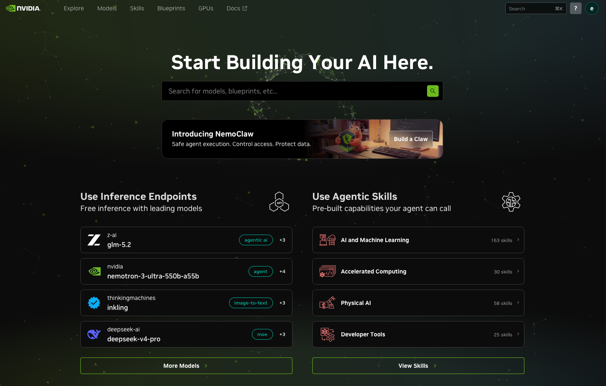
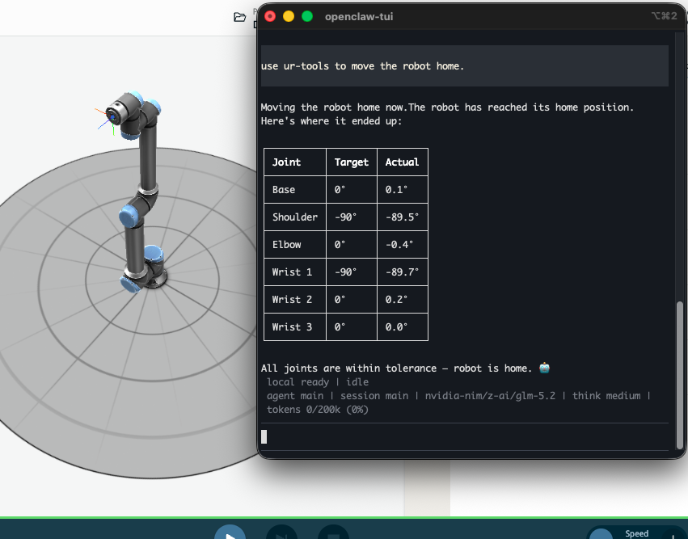

# Cloud-hosted LLM (free hosted endpoint)

Uses a model someone else runs, over an OpenAI-compatible API. No big download,
faster than a laptop, but needs a free account and an API key. Good if your
laptop cannot run a local model, or you want a stronger model.

Recommended endpoint: **NVIDIA NIM** (build.nvidia.com). Free inference on many
models behind one OpenAI-compatible API. Recommended chat client: **OpenClaw**, a
CLI agent (like Claude Code) that connects to any OpenAI-compatible endpoint and
supports MCP servers. Other options at the end.

## 1. Get a key and a model id (NVIDIA NIM)
1. Go to https://build.nvidia.com, sign in (free), verify your identity.
2. On the home page, under **Use Inference Endpoints** ("Free inference with
   leading models"), pick a model that supports tool calling. `z-ai / glm-5.2`
   works well (tagged `agentic ai`, `Free Endpoint`).

   

3. Open the model page. Check Capabilities lists **Function Calling: Supported**
   (required for MCP tools).
4. Click **Get API Key** / **Generate API Key**. Copy it (starts `nvapi-`).

You do not run NVIDIA's sample code. The Python snippet on that page is just a
demo. You only need three values, all shown on that page:

- **Base URL**: `https://integrate.api.nvidia.com/v1`
- **Model id**: the `model="..."` value, e.g. `z-ai/glm-5.2`
- **API key**: the `nvapi-...` key you generated

Keep the key private. Do not commit it. If it leaks, regenerate it on the site.

## 2. Use it through a chat (OpenClaw)
OpenClaw is a terminal chat client. Install it, point it at the endpoint from
step 1, and chat.

### Install
```bash
curl -fsSL https://openclaw.ai/install.sh | bash
```
Follow the onboarding prompts. You can decline any optional channels/logins; you
only need the local CLI. When it finishes you have the `openclaw` command.

### Add the endpoint as a provider
OpenClaw stores providers in its config. Create a small patch file with your
three values. Save this as `/tmp/nvidia.patch.json5` (put your real `nvapi-` key
in `apiKey`):
```json5
{
  models: {
    providers: {
      "nvidia-nim": {
        baseUrl: "https://integrate.api.nvidia.com/v1",
        api: "openai-completions",
        apiKey: "nvapi-YOUR-KEY-HERE",
        models: [
          { id: "z-ai/glm-5.2", name: "GLM 5.2", reasoning: true, input: ["text"] }
        ]
      }
    }
  }
}
```
Put the key straight into `apiKey` as a plain string. OpenClaw runs a background
gateway daemon; a plain string is the one form it resolves reliably. (An env-var
reference can be invisible to the daemon and gives "No API key found".)

Apply it, then make it the default model:
```bash
openclaw config patch --file /tmp/nvidia.patch.json5 --dry-run   # preview
openclaw config patch --file /tmp/nvidia.patch.json5             # apply
openclaw models set nvidia-nim/z-ai/glm-5.2                       # default model
openclaw models list | grep glm                                  # confirm it is default
```
`models list` should show `nvidia-nim/z-ai/glm-5.2` marked as default. If instead
chat later says "no models available" or names some `openai/...` model, the
default was not set: re-run `openclaw models set nvidia-nim/z-ai/glm-5.2`.

If chat says "No API key found for provider 'nvidia-nim'" even after the patch,
set the key directly (this writes the same plain-string value the daemon reads):
```bash
openclaw config set models.providers.nvidia-nim.apiKey "nvapi-YOUR-KEY-HERE"
openclaw models set nvidia-nim/z-ai/glm-5.2
```
This is the manual fix if the patch file did not take. Same key, straight into the
config.

### Chat
```bash
openclaw chat
```
Type a message and get a reply. The bottom status bar shows the active model; it
should read `nvidia-nim/z-ai/glm-5.2`. This is where you talk to the model and,
once you add an MCP server (section 4), where it calls tools.

## 3. Use it through the API
The endpoint is plain OpenAI-compatible, so any OpenAI client or library works.
Point it at the three values from step 1:

```python
from openai import OpenAI
c = OpenAI(
    base_url="https://integrate.api.nvidia.com/v1",
    api_key="nvapi-...",          # your key
)
r = c.chat.completions.create(
    model="z-ai/glm-5.2",         # your model id
    messages=[{"role": "user", "content": "Reply with the single word OK."}],
    temperature=0,
)
print(r.choices[0].message.content)
```
Expect `OK`. Auth or model-id errors show up here.

## 4. Add an MCP server
This connects tools to the chat so the model can act, not just talk. In OpenClaw
you register an MCP server with one command. The example below is the UR robot
server (an MCP server that exposes robot tools):
```bash
openclaw mcp add ur-tools \
  --command /PATH/TO/python3 \
  --arg "/PATH/TO/case 1/server.py"
openclaw mcp probe ur-tools     # lists the server's tools; expect 2 tools
```
- `--command`: the absolute path to the Python that has the server's deps
  installed. Find it with `which python3`, e.g. `/opt/homebrew/bin/python3`. Not
  bare `python3`: launched processes get a minimal PATH.
- `--arg`: the absolute path to the MCP server script (for the UR server,
  `case 1/server.py`). Quote it because the path has a space.

Now start (or restart) `openclaw chat` and ask the model to use the tools. Below,
a **Case 1 example**: the model called `ur-tools` to move the robot home, and the
sim on the left obeyed. Every joint landed within tolerance of its home target.



## Other free options
Clients (any that support a custom OpenAI endpoint plus MCP): OpenClaw (above),
Cline, LibreChat, Cherry Studio. The endpoint values are the same everywhere;
only the menu wording differs, so follow that client's docs.

Endpoints:
- Z.AI: GLM models direct from the maker, OpenAI-compatible. Same three values
  with Z.AI's base URL, key, and model id.
- Modal.com: free compute credits; host a model behind an OpenAI-compatible route.
- Puter.js: free and zero-config, but a browser JavaScript SDK, not an
  OpenAI-compatible HTTP endpoint. Use it only if you build your own JavaScript
  client.

You may also use any LLM you already have access to: plug its OpenAI-compatible
endpoint in place of the three values above.
