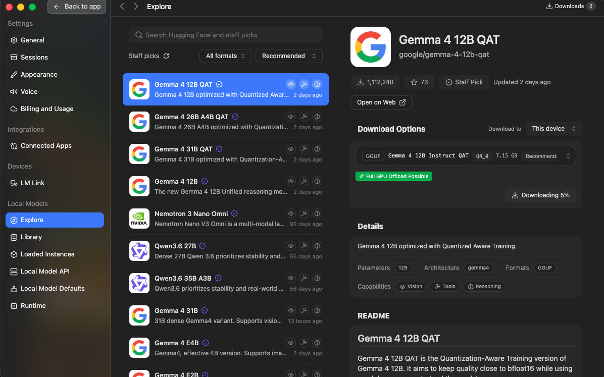
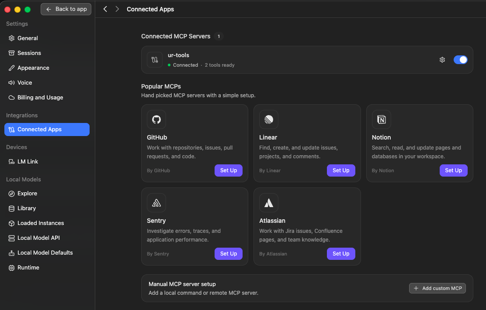
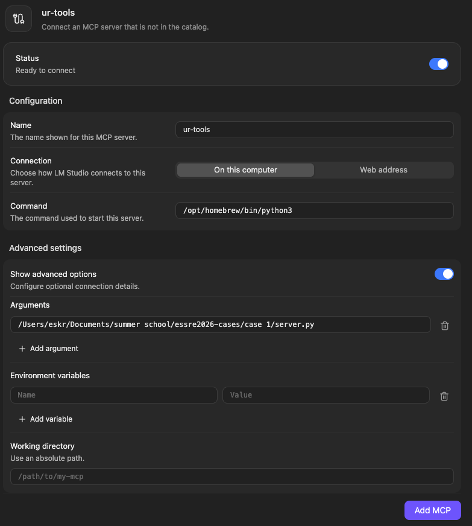
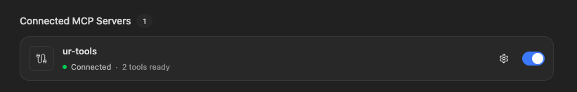

# Self-hosted LLM (Bionic, local, free)

Runs a model on your own laptop. Zero cost, no account, works offline. Slower
than a hosted model. Good if your laptop can run a mid-size model.

The app is Bionic. It gives you a chat window, a local OpenAI-compatible API, and
MCP support, all in one place.

## 1. Install
Download it from https://lmstudio.ai and install it. The download link says LM
Studio; the installed app UI is branded Bionic. Same app. Free, runs on macOS
(Apple Silicon), Windows, and Linux.

## 2. Pick a model that can use tools
Open the Explore tab and browse the Staff picks. Each model lists its
Capabilities. You need one that has the **Tools** capability (the wrench icon).
Without it the model cannot call MCP tools.

Two rules, that is the whole choice:
- **Tools** capability present (wrench icon).
- It fits your machine: on the download panel pick a quant that shows a green
  "Full GPU Offload Possible" (or a green fit badge).

In the shot above: the Capabilities row shows **Tools**, and the download panel
shows GGUF Q4_0, 7.15 GB, with green "Full GPU Offload Possible". That is exactly
what you want.

Good picks (both have Tools):
- **Gemma 4 12B QAT**: about 7 GB, fast, fits most laptops. A fine default.
- **Qwen3.6 27B**: larger (about 16 GB), more reliable at tool calling. Use it
  if a smaller model fumbles the tool call, and if you have the RAM.

Download the model, then load it (top of the app). The file is a GGUF: one
compressed model file. The quant level (for example Q4) trades size for quality;
the default the app recommends is fine.

## 3. Use it through the chat
Load the model, type in the chat box, get a reply. That is the whole loop. This
is where you will talk to the model and, once you add an MCP server (section 5),
where it can call tools.

Note: a 12B model with reasoning on can take over a minute per reply on a laptop.
That is the model, not a bug. For speed, pick a smaller Tools-capable model, or
use the cloud path (see cloud-hosted.md).

## 4. Use it through the local API
Bionic can also serve the model over an OpenAI-compatible HTTP API, so your own
code or any OpenAI-compatible tool can call it.

1. Open the Developer / Local Server tab and Start the server. It listens on
   `http://localhost:1234/v1`.
2. Use it like any OpenAI endpoint. Three values:
   - Base URL: `http://localhost:1234/v1`
   - API key: any non-empty string (a local server ignores it)
   - Model id: the id shown for the loaded model in Bionic

## 5. Add an MCP server
This connects tools to the chat. The example below is the UR robot server.

1. Open Settings, Connected Apps. Under Manual MCP server setup, click
   **Add custom MCP** (bottom right).

   

2. Fill the form:
   - **Name**: `ur-tools`
   - **Connection**: On this computer
   - **Command**: the absolute path to the Python that has the server's deps
     installed. Find it with `which python3`, for example
     `/opt/homebrew/bin/python3`. Not bare `python3`: GUI apps launch with a
     minimal PATH.
   - Turn on **Show advanced options**.
   - **Arguments**: one argument, the absolute path to the MCP server script (for
     the UR server, `case 1/server.py`). No quotes even though the path has
     spaces.
   - Leave Environment variables and Working directory empty.

   

3. Click **Add MCP**. It should report Connected, with the server's tools ready.

   

The tools now appear in the chat and the loaded model can call them. Bionic may
ask you to confirm a tool call the first time.
